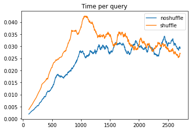
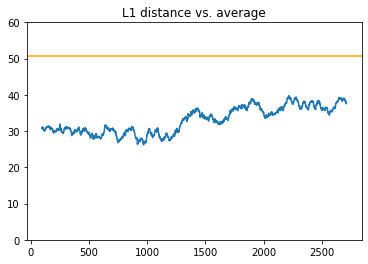

# Correlation cache

Online correlation cache, based on links online clustering

For Siamese Neural Network training

## Usage example

```python
from cache_wrapper import EvictingCacheWrapper
import numpy as np

cache = EvictingCacheWrapper(0.1, 0.05, 1.0, True, 10)
for i in range(100):
    cache.push(new_key=i, new_vector=streaming_input_vectors[i], top_n=0)
similar_vectors = cache.push(new_key=100, new_vector=np.array([1,0,0,0,0]), top_n=10)
...
```

For more usage examples, see the `tests`.

## Benchmark
Do shuffle!




## TODO
* Add more tests
* Implement least correlation query 
* Test performance for N = 10k, 100k, 1M


----

# Links Online Clustering

Python implementation of the Links Online Clustering algorithm: 
https://arxiv.org/abs/1801.10123

__Title__: Links: A High-Dimensional Online Clustering Method

__Authors__: Philip Andrew Mansfield, Quan Wang, Carlton Downey, Li Wan, Ignacio Lopez Moreno

## Overview
This is a clustering algorithm for online data. That is, it will predict 
cluster membership for vectors that it is shown one-by-one. It does not 
require examining the entire dataset to predict cluster membership.

It works by maintaining a two-level hierarchy of clusters and subclusters.
Each subcluster has a centroid that is compared with new vector for prediction
using cosine similarity. Depending on the previous data that has been seen, 
the new data point can be assigned to an existing cluster/subcluster, 
assigned to a new subcluster within an existing cluster, or 
assigned to a new subcluster and cluster. 

Instantiating the class requires 3 hyperparameters:
* cluster_similarity_threshold
* subcluster_similarity_threshold
* pair_similarity_maximum

These details are best understood by reading the paper.

## Installation

`pip install -r requirements.txt`

## Usage example

```python
from links_cluster import LinksCluster

...
links_cluster = LinksCluster(cluster_similarity_threshold, subcluster_similarity_threshold, pair_similarity_maximum)
for vector in data:
    predicted_cluster = links_cluster.predict(vector)

```

For more usage examples, see the `tests`.


